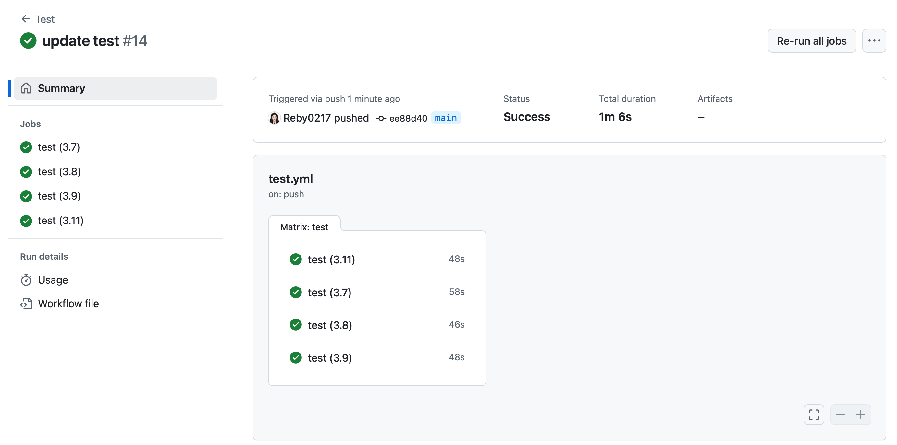

# IDS706 Gitlab/Github Actions Matrix Build for Multiple Python Versions


## Continuous Integration with GitHub Actions
[](https://github.com/Reby0217/ids706-miniProj4/actions/workflows/install.yml)
[](https://github.com/Reby0217/ids706-miniProj4/actions/workflows/lint.yml)
[](https://github.com/Reby0217/ids706-miniProj4/actions/workflows/format.yml)
[](https://github.com/Reby0217/ids706-miniProj4/actions/workflows/test.yml)


This project focuses on implementing a GitHub Actions matrix build to test the code across 4 Python versions (`3.7`, `3.8`, `3.9`, `3.11`). It automates testing, formatting, linting, and dependency management, ensuring code compatibility across multiple environments. The project also includes descriptive statistical analysis using a dataset of the 1000 wealthiest people globally.

--- 


## Deliverables
- **Link to successful GitHub Actions Matrix run**: You can view a successful matrix build run [here](https://github.com/Reby0217/ids706-miniProj4/actions/workflows/test.yml).



---


## Project Structure
```bash
.
├── src
│   ├── cli.py                         # Script for descriptive statistics and data analysis
│   └── lib.py                         # Library with reusable functions for data processing
│   └── Top_1000_wealthiest_people.csv # Dataset with information on the wealthiest people
│   └── individual_proj_1.ipynb        # Jupyter Notebook for data analysis and visualization
├── tests
│   ├── test_lib.py                    # Unit tests for the library functions
│   └── test_script.py                 # Unit tests for the CLI script
├── requirements.txt                   # Project dependencies
├── Makefile                           # Commands for install, setup, test, lint and format
└── screenshots                        # Images for README visualization
```

## GitHub Actions CI/CD Workflow

The project is configured to run GitHub Actions workflows to automate various tasks such as testing, linting, and formatting.

### Matrix Build for Python Versions

The `test.yml` workflow is configured to test the codebase across **4** different Python versions: `3.7`, `3.8`, `3.9`, and `3.11`. This matrix strategy ensures the compatibility and correctness of the code in multiple Python environments:


```yaml
strategy:
  matrix:
    python-version: ['3.7', '3.8', '3.9', '3.11']
```

## Makefile

The project uses a `Makefile` to streamline development tasks, including testing, formatting, linting, and installing dependencies. Key Makefile commands:

- **Test**: Runs tests for the notebook, script, and library.
  ```bash
  make test
  ```
  
- **Format**: Formats all Python files using `black`.
  ```bash
  make format
  ```

- **Lint**: Checks the code quality using `Ruff`.
  ```bash
  make lint
  ```

- **Install**: Installs all required dependencies from `requirements.txt`.
  ```bash
  make install
  ```

- **All**: Runs all major tasks (`install`, `setup`, `lint`, `test`, and `format`) in one command.
  ```bash
  make all
  ```

## Getting Started

### Prerequisites

- Python 3.7+
- `pip` for managing dependencies

### Installation

1. Clone the repository:

   ```bash
   git clone https://github.com/Reby0217/ids706-miniProj4.git
   cd ids706-miniProj4
   ```

2. Create and activate a virtual environment:

   ```bash
   python3 -m venv venv
   source venv/bin/activate 
   ```

3. Install dependencies:

   ```bash
   make install
   ```

### Running Tests

To run all tests (for both the notebook and the scripts):

```bash
make test
```

### Linting and Formatting

To format the code using `black`, run:

```bash
make format
```

To lint the code using `Ruff`, run:

```bash
make lint
```

## Data Sample


## Descriptive Statistics


### Skewness and Kurtosis of Net Worth Distribution


### Average Net Worth by Industry


## Bar Plot: Average Net Worth by Industry


## Box Plot: Net Worth Distribution by Industry
